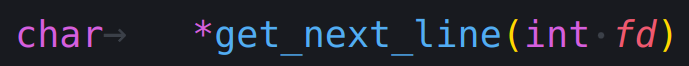

<div id="top"></div>

<div align="center">
	<a href="https://github.com/Link-Wolf/get_next_line" title="Go to GitHub repo"></a>
	<a href="https://"></a>
	<a href="https://"></a>
	<a href="https://github.com/Link-Wolf/get_next_line/stargazers"></a>
	<a href="https://github.com/Link-Wolf/get_next_line/network/members"></a>
	<a href="https://github.com/Link-Wolf/get_next_line/issues"></a>
	<a href="https://www.apple.com/macos/" title="Go to Apple homepage"></a>
</div>

<!-- PROJECT LOGO -->
<br />
<div align="center">
  <a>
    
  </a>

  <h3 align="center">Get Next Line</h3>

  <p align="center">
	  <em>Reading a line on a fd is way too tedious</em><br/>
    A C function that returns a line ending with a newline, read from a file descriptor
    <br />
    <br />
    <a href="https://github.com/Link-Wolf/get_next_line/issues">Report Bug</a>
    ·
    <a href="https://github.com/Link-Wolf/get_next_line/issues">Request Feature</a>
  </p>
</div>

<!-- TABLE OF CONTENTS -->
<details>
  <summary>Table of Contents</summary>
  <ol>
    <li>
      <a href="#about-the-project">About The Project</a>
    </li>
    <li>
      <a href="#getting-started">Getting Started</a>
      <ul>
        <li><a href="#prerequisites">Prerequisites</a></li>
        <li><a href="#installation">Installation</a></li>
      </ul>
    </li>
    <li><a href="#usage">Usage</a></li>
    <li><a href="#roadmap">Roadmap</a></li>
    <li><a href="#contributing">Contributing</a></li>
  </ol>
</details>

<!-- ABOUT THE PROJECT -->

## About The Project

<div align="center">
  <a>
    
  </a>
</div>

This project is focused on writing our own function to get a line from a file descriptor, without knowing its size beforehand <br />

-   We must implement a buffer. We can't neither come back nor move in the file descriptor.
-   We can't use _lseek_, only _read_, _malloc_, _free_, nor the [libft](https://github.com/Link-Wolf/libft)
-   We can't use globals variables nor FILE structure, but static variables are allowed
-   The buffer size used by _read_ can be changed
-   Call the function in a loop will then allow to read the text available on a file descriptor one line at a time until the end of the text, no matter
    the size of either the text or one of its lines

There were also two additional bonus features

-   Be able to read multiple file descriptors at the same time
-   Only use **one** static variable
    <br />

<p align="right">(<a href="#top">back to top</a>)</p>

<!-- GETTING STARTED -->

## Getting Started

Because it's a simple C function, there isn't much to say here

### Prerequisites

Having a C compiler like cc, gcc or clang

### Installation

1. Clone the repo
    ```sh
    git clone https://github.com/Link-Wolf/get_next_line.git
    ```
2. Include get_next_line in your C project
    ```c
    #include "get_next_line/get_next_line_bonus.h"
    ```
3. Compile your project with the get_next_line sources
    ```sh
    gcc [your_project.c] get_next_line_bonus.c get_next_line_utils_bonus.c -D BUFFER_SIZE=<size>
    ```

<p align="right">(<a href="#top">back to top</a>)</p>

<!-- USAGE EXAMPLES -->

## Usage

Use the get_next_line function to read any file line by line !

```c

int fd = open("my_awesome_file", 0);
char *line = get_next_line(fd);

while (line)
{
	printf("Next line : %s\n", line);
	line = get_next_line(fd);
}
printf("End of file\n");
```

Output (cat -e)

```
Next line : my_first_line$
Next line : my_second_line$
Next line : my_third_line$
Next line : my_fourth_line$
. . .
End of file$
```

<p align="right">(<a href="#top">back to top</a>)</p>

<!-- ROADMAP -->

## Roadmap

-   [x] Add bonus features

See the [open issues](https://github.com/Link-Wolf/get_next_line/issues) for a full list of proposed features (and known issues).

<p align="right">(<a href="#top">back to top</a>)</p>

<!-- CONTRIBUTING -->

## Contributing

If you have a suggestion that would make this better, please fork the repo and create a pull request. You can also simply open an issue with the tag "enhancement".
Don't forget to give the project a star! Thanks again!

1. Fork the Project
2. Create your Feature Branch (`git checkout -b feature/AmazingFeature`)
3. Commit your Changes (`git commit -m 'Add some AmazingFeature'`)
4. Push to the Branch (`git push origin feature/AmazingFeature`)
5. Open a Pull Request

<p align="right">(<a href="#top">back to top</a>)</p>
